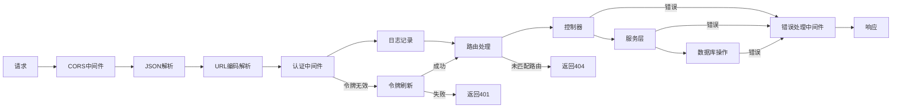

# vue3-web-backend

## 项目概述

vue3-web-backend 是一个基于 TypeScript 和 Express 框架开发的后端 API 服务，为博客或内容管理系统提供接口支持。项目使用 Prisma ORM 与 PostgreSQL 数据库交互，实现了用户认证、文章管理、邮箱验证等功能。

同时本项目还是vue3-web的后端服务

## 技术栈

- **核心框架**: Express.js
- **语言**: TypeScript
- **数据库**: PostgreSQL
- **ORM**: Prisma
- **缓存**: Redis
- **认证**: JWT (对称和非对称密钥)
- **邮件服务**: Nodemailer

## 项目结构

```
.
├── prisma/                  # Prisma 配置和模型定义
│   ├── migrations/          # 数据库迁移文件
│   └── schema.prisma        # 数据库模型定义
├── src/
│   ├── app.ts               # 应用程序入口文件
│   ├── config/              # 配置文件(包含密钥)
│   ├── controllers/         # 控制器
│   ├── middlewares/         # 中间件
│   ├── routes/              # 路由定义
│   ├── services/            # 业务逻辑服务
│   └── utils/               # 工具函数
├── .env                     # 环境变量(不纳入版本控制)
├── .env.example             # 环境变量示例
├── package.json             # 包依赖
└── tsconfig.json            # TypeScript 配置
```

## 安装与运行

1. 安装依赖:

```bash
yarn install
```

2. 配置环境变量:

```bash
cp .env.example .env
# 编辑 .env 文件配置数据库连接和邮箱信息
```

3. 生成密钥 (自动生成，或可以复制示例密钥):

```bash
cp src/config/private.example.key src/config/private.key
cp src/config/public.example.key src/config/public.key
cp src/config/symmetric.example.key src/config/symmetric.key
```

4. 数据库迁移:

```bash
npx prisma migrate deploy
```

5. 运行开发服务器:

```bash
yarn dev
```

6. 构建生产版本:

```bash
yarn build
yarn start
```

## 中间件顺序

示例流程图如下：




## API 端点

### 用户管理

- `POST /user/register` - 用户注册
- `POST /user/login` - 用户登录
- `POST /user/salt` - 获取密码加盐
- `GET /user/me` - 获取当前用户信息
- `PUT /user/update/username` - 更新用户名
- `PUT /user/update/email` - 更新邮箱
- `PUT /user/update/password` - 更新密码

### 验证码

- `PUT /verify/email` - 发送邮箱验证码
- `PUT /verify/phone` - 发送手机验证码

### 文章管理

- `GET /post` - 获取文章列表
- `GET /post/:id` - 获取文章详情
- `GET /post/categories` - 获取分类列表
- `GET /post/tags` - 获取标签列表

## 身份认证

项目使用 JWT 认证方式:

- 使用对称加密算法 HS256 生成短期访问令牌
- 使用非对称加密算法 RS256 生成长期刷新令牌
- 令牌自动刷新机制

认证流程:
1. 用户登录后获取访问令牌和刷新令牌
2. 请求受保护资源时需在请求头中带上访问令牌
3. 访问令牌过期后使用刷新令牌获取新的访问令牌

## 环境变量

项目使用的环境变量:

- `DATABASE_URL` - PostgreSQL 数据库连接字符串
- `EMAIL_USER` - 发送验证邮件的邮箱账号
- `EMAIL_PASS` - 发送验证邮件的邮箱密码

## 密钥管理

项目使用三种密钥:

- `private.key` - RSA 私钥，用于签发刷新令牌
- `public.key` - RSA 公钥，用于验证刷新令牌
- `symmetric.key` - 对称密钥，用于签发和验证访问令牌

## Prisma 模型

项目包含以下数据模型:

- `User` - 用户信息
- `Post` - 博客文章
- `Comment` - 评论
- `Category` - 文章分类
- `Tag` - 文章标签

## 开发指南

### 添加新路由

1. 在 routes 中创建路由文件
2. 在 controllers 中实现相应的控制器
3. 在 app.ts 中注册路由

### 修改数据库模型

1. 更新 schema.prisma 文件
2. 运行迁移命令:

```bash
npx prisma migrate dev --name <migration-name>
```

## 许可证

本项目使用 Apache License 2.0 许可证。详情请查看 LICENSE 文件。